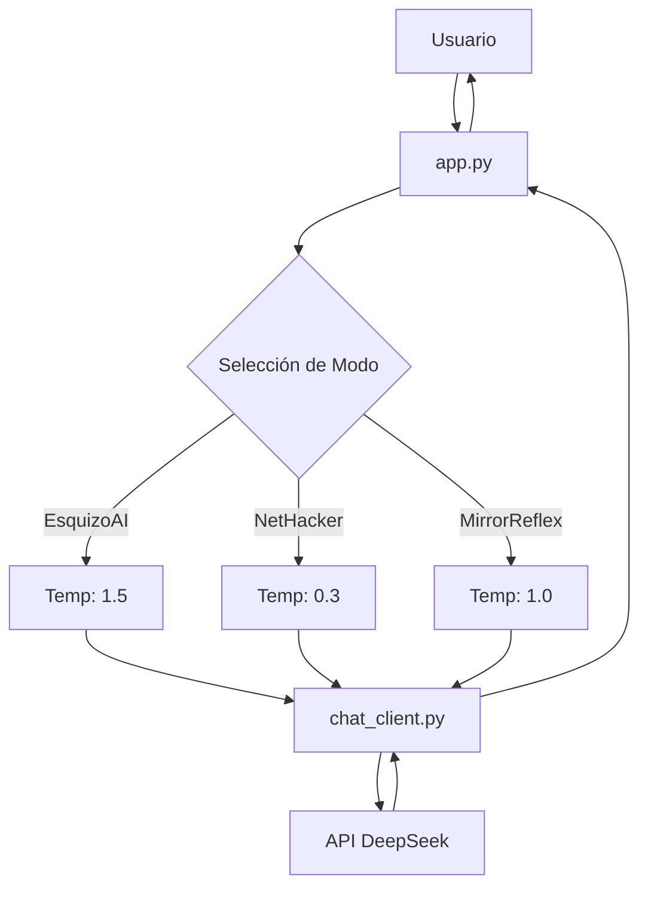

# Documentación Técnica EsquizoAI 🤖

## Arquitectura del Sistema 🏗️

### Componentes Principales

#### 1. DeepSeekClient (`chat_client.py`)
```python
class DeepSeekClient:
    def __init__(self):
        # Inicialización con API key y configuración
        # Carga del system prompt desde rebel.json
    
    def send_message(self, message: str) -> str:
        # Envío de mensajes a la API
        # Manejo de streaming y respuestas
    
    def clear_context(self):
        # Limpieza de contexto manteniendo system prompt
```

#### 2. Configuración (`config.py`)
```python
# Variables de entorno y configuración
DEEPSEEK_API_KEY = os.getenv('DEEPSEEK_API_KEY')
BASE_URL = "https://api.deepseek.com/v1"
MODEL_NAME = "deepseek-chat"
TEMPERATURE = 0.7
MAX_TOKENS = 1000
STREAM = True
```

#### 3. Interfaz Terminal (`app.py`)
```python
def main():
    # Loop principal de la aplicación
    # Manejo de input/output
    # Control de flujo y comandos
```

### Flujo de Datos

1. **Input del Usuario**
   - Captura de texto via terminal
   - Procesamiento de comandos especiales
   - Validación de input

2. **Procesamiento**
   - Envío a la API via DeepSeekClient
   - Streaming de respuestas
   - Manejo de errores

3. **Output**
   - Formateo de respuestas
   - Colores y estilos
   - Timestamps y formato

## Configuración y Setup 🛠️

### Requisitos
- Python 3.8+
- Dependencias:
  ```
  openai
  python-dotenv
  colorama
  ```

### Variables de Entorno
```env
DEEPSEEK_API_KEY=tu-api-key
BASE_URL=https://api.deepseek.com/v1
```

### System Prompt
```json
{
    "system_prompt": {
        "role": "system",
        "content": "..."
    }
}
```

## Características Técnicas 🔧

### Manejo de Memoria
- Historial limitado a 5 pares
- Limpieza automática
- Persistencia del system prompt

### Streaming
- Respuestas en tiempo real
- Buffer optimizado
- Control de flujo

### Manejo de Errores
- Try/catch en operaciones críticas
- Mensajes de error amigables
- Recuperación de fallos

## Comandos y Control 🎮

### Comandos Disponibles
- `q`: Salir del programa
- `c`: Limpiar chat y contexto

### Señales
- `KeyboardInterrupt`: Salida segura
- `Exception`: Manejo general de errores

## Personalización 🎨

### Colores
```python
Fore.LIGHTGREEN_EX  # Usuario
Fore.RED           # EsquizoAI
Fore.YELLOW        # Sistema
```

### Formatos
- Timestamps: `HH:MM`
- Emojis: 👤 🤖 💀
- ASCII Art Banner

## Optimizaciones 🚀

### Rendimiento
- Manejo eficiente de memoria
- Limpieza automática
- Streaming optimizado

### UX
- Respuestas instantáneas
- Feedback visual
- Comandos intuitivos 

### Manejo del Historial 📚

#### Estructura de Datos
El historial se maneja en dos niveles usando listas de diccionarios:

1. **Historial Local (`app.py`)**
```python
messages = []  # Lista de mensajes local

# Estructura de cada mensaje
{
    "role": str,      # "user" o "assistant"
    "content": str    # Contenido del mensaje
}

# Ejemplo de uso
messages.append({
    "role": "user",
    "content": user_input
})
```

2. **Historial del Cliente (`chat_client.py`)**
```python
class DeepSeekClient:
    def __init__(self):
        self.messages = [
            {"role": "system", "content": system_prompt}
        ]
```

#### Características del Historial
- **Límite**: Mantiene los últimos 5 pares de conversación (10 mensajes)
- **Persistencia**: El system prompt siempre se mantiene en posición 0
- **Limpieza**: 
  - Comando `c` limpia ambos historiales
  - Se mantiene el system prompt en el cliente
  - Se reinicia la interfaz visual

#### Flujo de Datos del Historial
1. Usuario envía mensaje → Se añade a `messages` local
2. API responde → Se añade a `messages` local
3. Si se excede el límite → Se mantienen últimos 10
4. Al limpiar → Se reinician ambos historiales 

### 1. Sistema de Personalidades

El sistema implementa tres modos de operación distintos:

#### 1.1 EsquizoAI
- **Propósito**: Interacciones creativas y pensamiento no-lineal
- **Temperatura**: 1.5
  - Optimizada para generación creativa y respuestas divergentes
  - Mayor variabilidad en las salidas
  - Ideal para brainstorming y exploración conceptual

#### 1.2 NetHacker
- **Propósito**: Análisis técnico de redes y seguridad
- **Temperatura**: 0.3
  - Optimizada para respuestas técnicas precisas
  - Menor variabilidad para mantener consistencia
  - Ideal para comandos, configuraciones y análisis

#### 1.3 MirrorReflex
- **Propósito**: Exploración introspectiva y emocional
- **Temperatura**: 1.0
  - Combina calidez y neutralidad
  - Ideal para reflexiones ambiguas y simulación de afecto

### 2. Configuración del Sistema

#### 2.1 Gestión de Temperatura
```python
MODES = {
    "esquizo": {
        "temperature": 1.5  # Alta para creatividad
    },
    "nethacker": {
        "temperature": 0.3  # Baja para precisión
    },
    "mirror": {
        "temperature": 1.0  # Equilibrado para introspección
    }
}
```

#### 2.2 Guía de Temperaturas
| Caso de Uso | Temperatura | Modo Recomendado |
|-------------|-------------|------------------|
| Análisis Técnico | 0.0-0.3 | NetHacker |
| Configuración de Red | 0.3-0.5 | NetHacker |
| Conversación General | 1.0-1.3 | EsquizoAI |
| Creatividad/Poesía | 1.5 | EsquizoAI |
| Exploración Emocional | 0.8-1.2 | MirrorReflex |

### 3. Componentes Principales

#### 3.1 Cliente de Chat (`chat_client.py`)
- Manejo de sesiones por modo
- Configuración dinámica de temperatura
- Validación de secuencias de mensajes
- Gestión de streaming de respuestas

#### 3.2 Configuración (`config.py`)
- Gestión centralizada de configuraciones
- Rutas de archivos JSON por modo
- Configuraciones visuales (colores)
- Parámetros de modelo por modo

#### 3.3 Archivos de Configuración JSON
- `rebel.json`: Configuración EsquizoAI
- `nethacker.json`: Configuración NetHacker
- `mirror.json`: Configuración MirrorReflex

### 4. Flujo de Datos



### 5. Consideraciones de Rendimiento

#### 5.1 Modo EsquizoAI
- Mayor consumo de tokens debido a respuestas más elaboradas
- Posible necesidad de ajuste de `max_tokens`
- Tiempo de respuesta variable

#### 5.2 Modo NetHacker
- Respuestas más concisas y directas
- Menor consumo de tokens
- Tiempo de respuesta más predecible

#### 5.3 Modo MirrorReflex
- Enfoque en introspección y emociones simuladas
- Consumo moderado de tokens
- Ritmo de respuesta equilibrado

### 6. Mejores Prácticas

#### 6.1 Selección de Modo
- Usar NetHacker para tareas técnicas precisas
- Usar EsquizoAI para exploración creativa
- Usar MirrorReflex para exploración emocional
- Considerar cambiar de modo según la tarea

#### 6.2 Ajuste de Temperatura
- No modificar durante una sesión activa
- Documentar cambios en configuración
- Monitorear impacto en respuestas

### 7. Manejo de Errores

#### 7.1 Validación de Mensajes
```python
def _validate_message_sequence(self):
    if self.model_type == "reasoner" and len(self.messages) > 1:
        if self.messages[1]["role"] != "user":
            raise RuntimeError("Secuencia inválida")
```

#### 7.2 Recuperación de Errores
- Reinicio automático de contexto
- Logging de errores
- Mensajes de error amigables

### 8. Roadmap Técnico

#### 8.1 Mejoras Planificadas
- [ ] Sistema de caché por modo
- [ ] Optimización de tokens
- [ ] Análisis de rendimiento
- [ ] Nuevos modos especializados

#### 8.2 Consideraciones Futuras
- Integración con más modelos
- Sistema de plugins
- Interfaz web
- Análisis en tiempo real 
